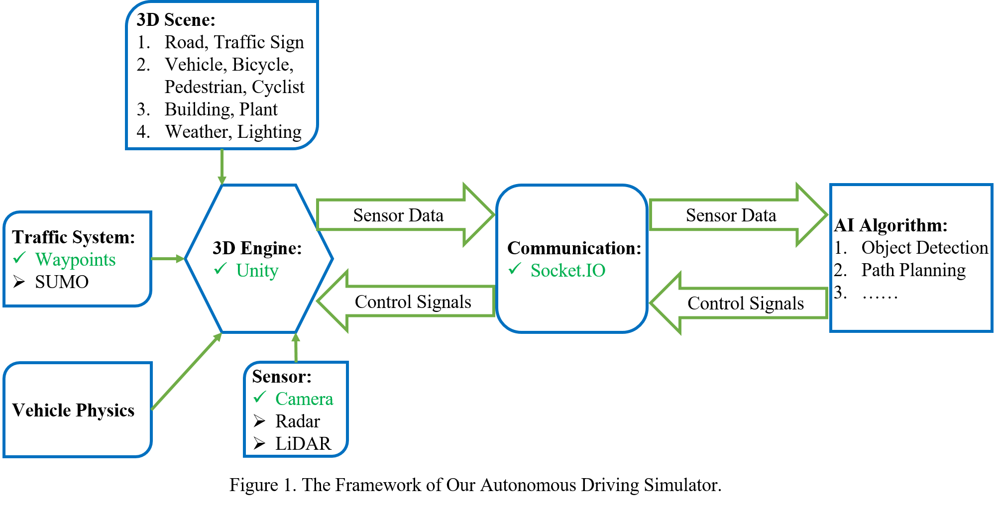
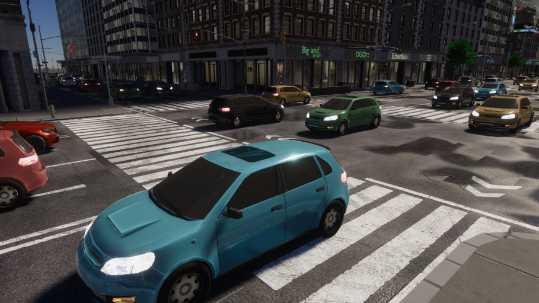
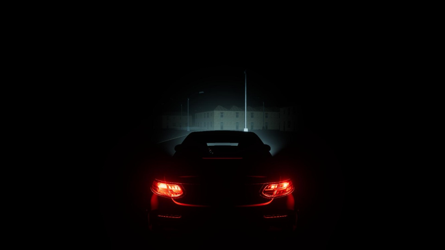
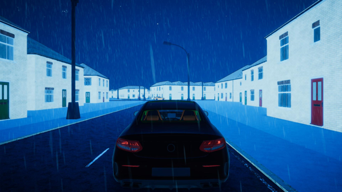
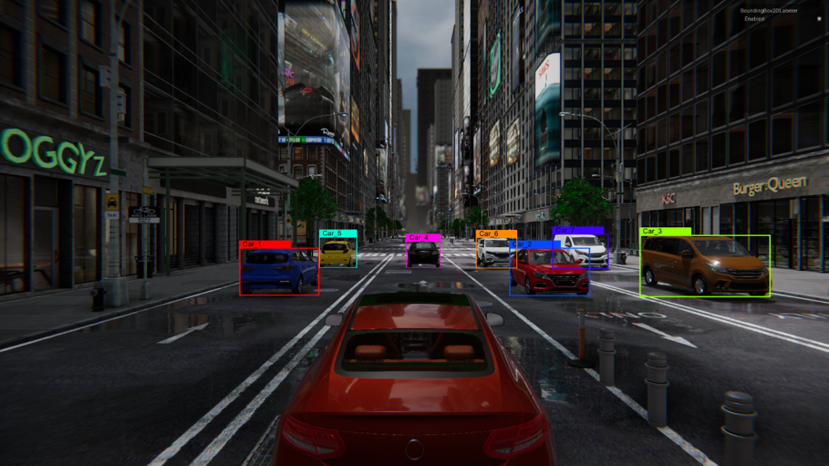
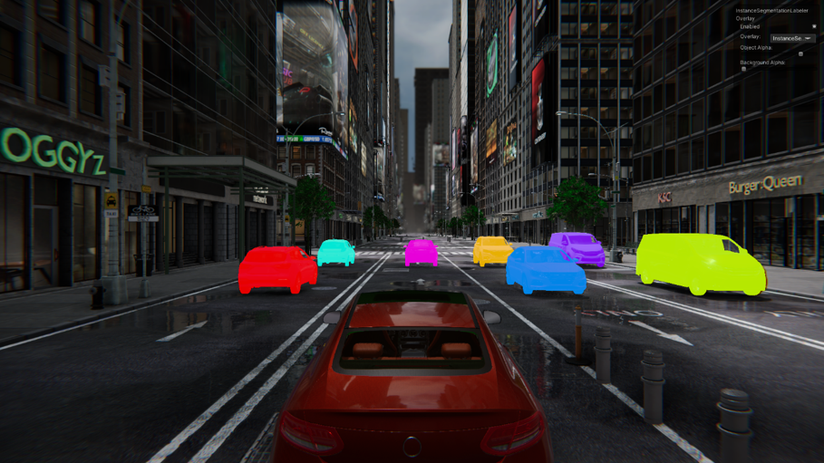
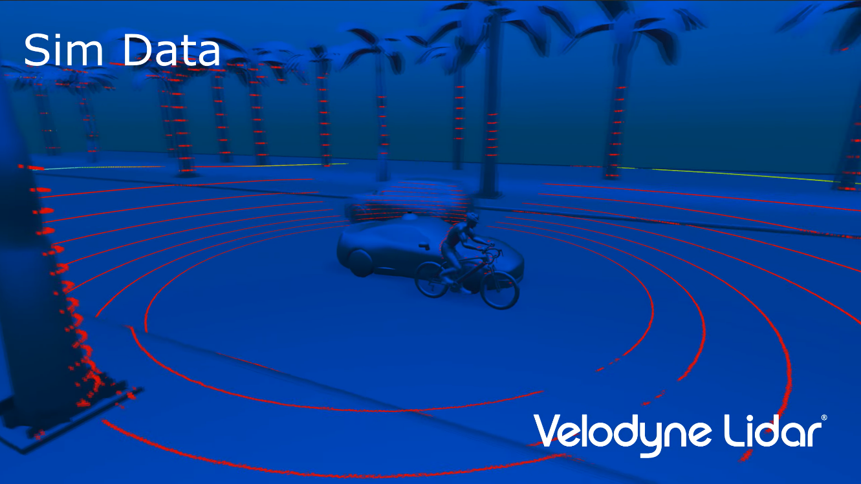
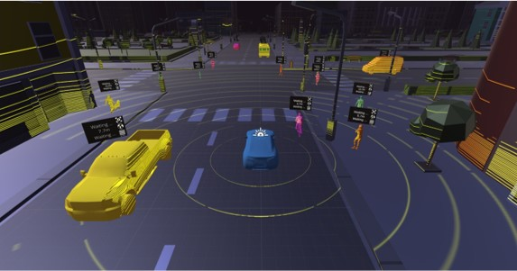

# Intelligent Driving System (Project Introduction)

 

## Table of Contents

- [Background](#background)
- [Framework](#framework)
- [Functions](#functions)
- [Contribute](#contribute)

## Background
The large-scale application of fully autonomous driving technology is the key to solving traffic congestion and reducing traffic accidents, and it is also an effective way to deal with the shortage of human resources. Commercial fully autonomous driving technology is expected to be deployed in the next five to ten years. However, this technology is currently only in the hands of a very small number of top technology companies. The vast majority of traditional automakers are not good at this technology, although they are eager to obtain this technology. We are developing a fully autonomous driving system that can be shared with traditional automakers, thereby accelerating the large-scale application of fully autonomous driving technology.

At present, our product is an autonomous driving system that can run in a simulation environment. We developed this simulator and trained autonomous driving algorithms such as environment perception, global/local path planning and decision making based on this simulator. Although this system works well in the simulator, it still needs road tests to verify its performance in the real environment, and then conduct large-scale simulation tests, repeating the cycle, and finally form a safe, reliable and practical autonomous driving system.
## Framework

## Functions
* ### High-definition digital twins of real cities and roads
Simulate complex and changeable real road scenarios to improve the ability of autonomous driving algorithms to deal with such scenarios.
<table>
  <tr>
    <td vlign="center">
      
    </td>
    <td vlign="center">
      
    </td>
  </tr>
</table>

* ### Simulation of light and weather changes
Simulate changes in light and weather to improve the robustness of autonomous driving algorithms.
<table>
  <tr>
    <td vlign="center">
      
    </td>
    <td vlign="center">
      
    </td>
  </tr>
</table>

* ### Automatic Data Labeling
The automatic data annotation function can automatically generate labels for training 2D/3D object detection and semantic/instance segmentation algorithms.
<table>
  <tr>
    <td vlign="center">
      
    </td>
    <td vlign="center">
      
    </td>
  </tr>
</table>

* ### Industrial LiDAR Simulation
Integrated Unity industrial-grade lidar simulation for training and testing 3D object detection, distance estimation and SLAM algorithms.
<table>
  <tr>
    <td vlign="center">
      
    </td>
    <td vlign="center">
      
    </td>
  </tr>
</table>

## Members

  
    Enthusiasts from the 
    <a href="https://www.ce.cit.tum.de/air/home/">Chair of Robotics, Artificial Intelligence and Real-time Systems, Technical University of Munich</a>
  

### Supervisor

* **[Prof. Dr.-Ing. habil. Alois Christian Knoll](https://www.ce.cit.tum.de/air/people/prof-dr-ing-habil-alois-knoll/)**

### Project Coordinator
* **[Zhou Liguo](https://www.ce.cit.tum.de/air/people/liguo-zhou/)**, *M.Sc.*

### Programmer
* **Dipl.-Ing. Cao Wei**, *M.Sc.*
* **[Liu Hao](linkedin.com/in/hao-liu97)**
* **Song Yinglei**
* **Ma Liang**
* **Liu Hongshen**
* **Li Haichuan**
* **Cui Chuanlu**
* **Liu Yang**
* **Gao Yichao**

### Artist
* **Liu Lian**

### Former Members

* Zhang Chao, *M.Sc.*; Zhang Jingyu; Lin Tianhao, *M.Sc.*; Zhang Hanzhen, *M.Sc.*; Wang Ruining; Meng Jun

### External Members

* Huo Yifan; Ren Peng; Zhang Yujie

