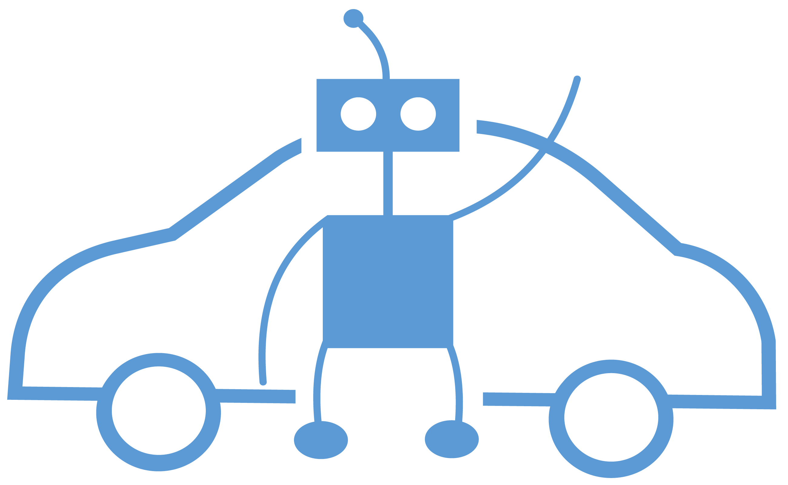
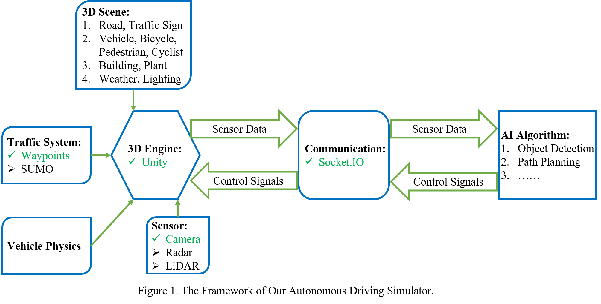
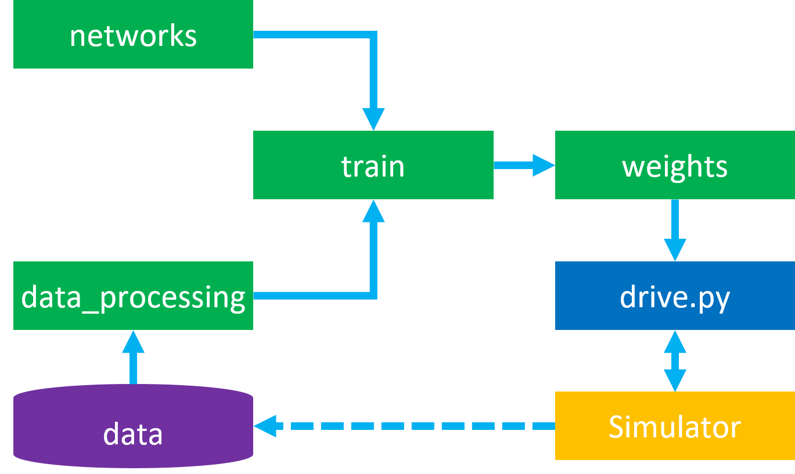
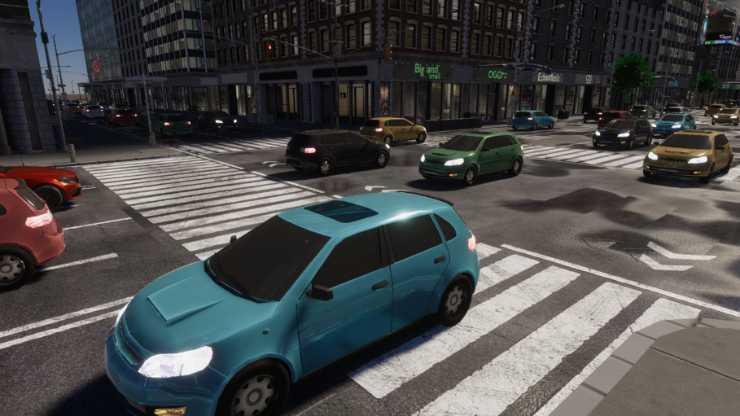
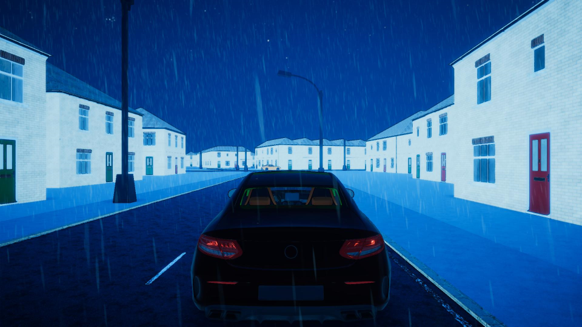
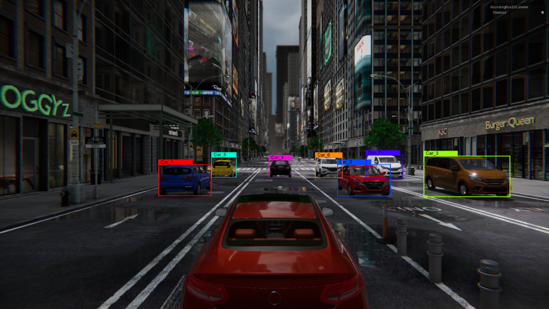
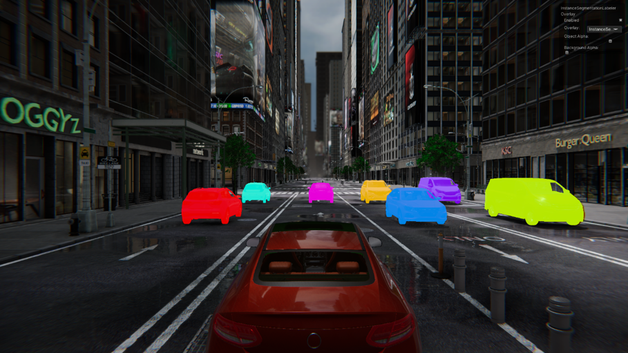
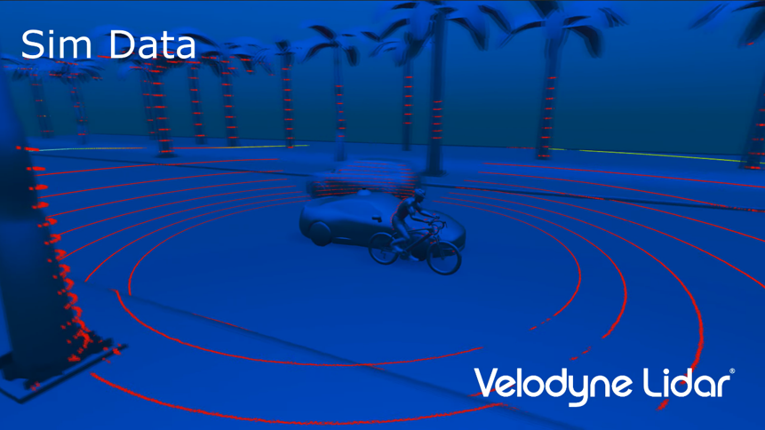
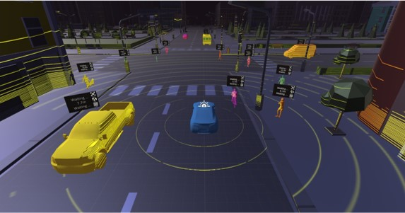

English | [中文](https://github.com/tum-autonomousdriving/.github/blob/main/profile/README_zh.md)
# Autonomous Driving Simulator

<p align="center"> </p>

## Contents

- [Framework](#framework)
- [Instructions](#instructions)
- [Developers](#developers)

## Framework


## Instructions

### 1. Workflow


```
Step 1: Collect data from the Simulator
Step 2: Design neural network class (torch.nn.Module)
        Write data processing class (torch.utils.data.Dataset)
Step 3: Train the model and save weights (torch.utils.data.DataLoader, optimizer, loss function, …)
Step 4: Drive a car in the Simulator using the trained model

```

### 2. Train

Please open the "Simulator_train" application on your operating system.

Once opened, the Scene will initiate the recording of training data, which will be saved in the "Data/DatasetX/IMG" path and the "Data/DatasetX/VehicleData.txt" file.

In this `VehicleData.txt` the data is: the path of IMG, throttle(range: 0 to 1), brakes(range: 0 to 1), sterring(range: -1 to 1).

**Please note that you should not remove the "Index.txt" file from the "Data/" directory.**

### 3. Drive

Please open the "Simulator_test" application on your operating system.

and then run your: 
```
python drive.py
```
In this scene, 3 images are output to your net, and 3 elements of control are acepted.(throttle, brakes and steering)

### 4. Simulator Functions
<table>
    <tr>
        <th>Function</th>
        <th>Keyboard Defaults</th>
        <th>Gamepad Defaults</th>
    </tr>
    <tr>
        <td>Sterring</td>
        <td>A/D</td>
        <td>Left Stick - Left/Right</td>
    </tr>
    <tr>
        <td>Throttle</td>
        <td>W</td>
        <td>Left Stick - Up, Right Trigger</td>
    </tr>
    <tr>
        <td>Brakes</td>
        <td>S</td>
        <td>Left Stick - Down, Left Trigger</td>
    </tr>
    <tr>
        <td>Reset the Position</td>
        <td>F1</td>
        <td>-</td>
    </tr>
    <tr>
        <td>Switch mouse control</td>
        <td>Mouse right button</td>
        <td>-</td>
    </tr>
    <tr>
        <td>Quit</td>
        <td>ESC</td>
        <td>-</td>
    </tr>
    <!--
    <tr>
        <td></td>
        <td></td>
        <td></td>
        <td></td>
        <td></td>
    </tr>
    -->
</table>

### 5. Simulator Scenes Download Link: 

Source code:

https://gitlab.lrz.de/tum-autonomousdriving/autonomous-driving

Build:

https://syncandshare.lrz.de/getlink/fiEQ6uWeJQFmosTX7HsxwG/

<!--
## Functions
* ### High-definition digital twins of real cities and roads
Simulate complex and changeable real road scenarios to improve the ability of autonomous driving algorithms to deal with such scenarios.
<table>
  <tr>
    <td vlign="center">
      
    </td>
    <td vlign="center">
      
    </td>
  </tr>
</table>

* ### Simulation of light and weather changes
Simulate changes in light and weather to improve the robustness of autonomous driving algorithms.
<table>
  <tr>
    <td vlign="center">
      
    </td>
    <td vlign="center">
      
    </td>
  </tr>
</table>

* ### Automatic Data Labeling
The automatic data annotation function can automatically generate labels for training 2D/3D object detection and semantic/instance segmentation algorithms.
<table>
  <tr>
    <td vlign="center">
      
    </td>
    <td vlign="center">
      
    </td>
  </tr>
</table>

* ### Industrial LiDAR Simulation
Integrated Unity industrial-grade lidar simulation for training and testing 3D object detection, distance estimation and SLAM algorithms.
<table>
  <tr>
    <td vlign="center">
      
    </td>
    <td vlign="center">
      
    </td>
  </tr>
</table>
-->

## Useful Vision Algorithms

Pretrained Weights:

https://syncandshare.lrz.de/getlink/fi6mGLJoqSu3GEBxW7aWNT/weights

### 1. Object Detection

1.1 YOLOv5

1.2 YOLOv8

### 2. Semantic Segmentation

2.1 YOLOv5_sg

## Developers

### 1. Affiliation

<a href="https://www.ce.cit.tum.de/air/home/">Chair of Robotics, Artificial Intelligence and Real-time Systems</a> · <a href="https://www.tum.de/">Technical University of Munich</a>

### 2. Supervisor

**[Prof. Dr.-Ing. habil. Alois Christian Knoll](https://www.ce.cit.tum.de/air/people/prof-dr-ing-habil-alois-knoll/)**


### 3. Programmers

<table>
    <tr>
        <td><font size='4'>Gao Yichao</font></td>
        <td><font size='3'>Yu Zhou</font></td>
        <td>Michael Sodamin</td>
        <td></td>
        <td></td>
    </tr>
    <tr>
        <td>Song Yinglei</td>
        <td>Liu Hao</td>
        <td>Liu Hongshen</td>
        <td>Liu Lian</td>
        <td>Liu Zhuo</td>
    </tr>
      <tr>
        <td>Xie Tongtong</td>
        <td>Yang Xiaohan</td>
        <td></td>
        <td></td>
        <td></td>
    </tr>
    <!--
    <tr>
        <td></td>
        <td></td>
        <td></td>
        <td></td>
        <td></td>
    </tr>
    -->
</table>

### 4. Corresponding Programmer

周立国 <a href="https://www.ce.cit.tum.de/air/people/liguo-zhou/">Zhou Liguo</a>
<!--
### Former Members
* Dipl. Cao Wei, *M.Sc.*; Zhang Jingyu; Zhang Hanzhen, *M.Sc.*; Meng Jun; Cui Chuanlu; Li Haichuan
* Zhang Chao, *M.Sc.*; Lin Tianhao, *M.Sc.*; Wang Ruining, *M.Sc.*; Huo Yifan; Ren Peng; Zhang Yujie
-->
